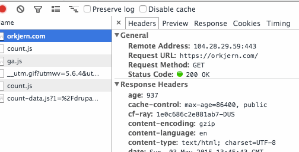

# tessel-ir-to-drupal
Turn off a Drupal site with a remote control.

[](https://travis-ci.org/eiriksm/tessel-ir-to-drupal)
[](https://codeclimate.com/github/eiriksm/tessel-ir-to-drupal)
[](https://codeclimate.com/github/eiriksm/tessel-ir-to-drupal)
[](https://david-dm.org/eiriksm/tessel-ir-to-drupal)

This was posted together with the blog post [Drupal and IoT. Code examples, part 1](https://orkjern.com/drupal-iot-code-part-one). It is supposed to be used [together with the maintenance_mode_ir module](https://github.com/eiriksm/maintenence-mode-ir), if you really, *really* want to use this for some reason.

This code (and the above module) was also used in the session "Drupal and Internet of Things" on Drupal Camp Oslo 2015.

## Usage

- Clone the repository.
- Install the dependencies (`npm install`)
- Make a copy of the `default.config.json` file called `config.json`
- Edit the values in `config.json` to provide session details, URL and off button value.
- Start the remote control listener with `tessel run start.js`

## How to get the value of your remote control

To get to the value referenced below you can use the following code:

```js
infrared.on('data', function(data) {
  for (var i = 0, n = data.length; i < n; ++i) {
    data[i] = data[i] ^ 0xFF;
  }
  var result = [], t;
  for (var i = 0; i < data.length; i += 2){
    t = (data[i] * 0x100 + data[i + 1]) ^ 65535;
    result[result.length] = (t > 32767 ? (-((t ^ 65535) + 1)) : t) / 50;
  }
  console.log(result);
});
```

## How to get the value for "session" in the config.

This should be explained [in the blog post mentioned above](https://orkjern.com/drupal-iot-code-part-one). You could also consult this animated gif, of course...



## Usage as a module

You can also install and require this as a module, if you want it to be part of a larger setup. In that case you would follow this recipe:

- Install `tessel-ir-to-drupal` as a dependency (currently only available through git).
- Require the module.
- Instantiate with a configuration object and a callback.

A quick example is this:

```js
var tessel = require('tessel');
var infraredlib = require('ir-attx4');
var infrared = infraredlib.use(tessel.port.B);

var config = {
  url: 'http://example.com',
  session: 'SESS51337Tr0lloll110l00l1=acbdef123abc1337H4XX',
  offButton: [ 91, -88, 13, -32, 12, -33, 12, -32, 13, -10, 12, -10, 13, -9, 13, -10, 12, -10, 12, -32, 14, -31, 13, -32, 13, -9, 13, -10, 12, -10, 12, -10, 13, -9, 13, -10, 12, -32, 13, -10, 12, -10, 13, -9, 13, -10, 13, -9, 13, -9, 13, -32, 13, -9, 13, -32, 12, -32, 13, -32, 12, -33, 12, -32, 13, -32, 12 ],
  tessel: tessel,
  infrared: infrared
};

var ird = require('tessel-ir-to-drupal');
ird(config, function(err, state) {
  if (err) {
    throw err;
  }
  console.log('IR ready to receive');
  // Check after a while if we have set a new value in some way. You probably
  // would use this differently in your application.
  setTimeout(function() {
    console.log('Current state is', state.getState());
  }, 60000);
});
```

## Usage generally.

I have no idea why you would use this.

## Licence

[WTFPL](http://www.wtfpl.net/)
